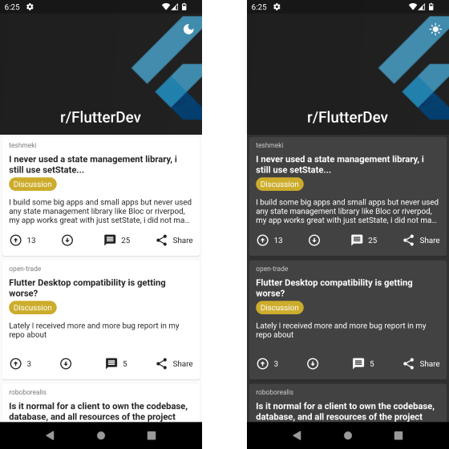

# Reddit Clone

The Reddit Clone app is a simple application built to mimic the functionality of Reddit. It allows users to view a list of posts on a single page and offers theme switching functionality. The app utilizes BLoC for efficient state management, Dio for fetching data from the API, shared_preferences for handling local storage, and cached_network_image for caching images.

## Features

- View a list of posts from the API.
- Implement a BLoC pattern for state management.
- Fetch data from the API using Dio.
- Switch between light and dark themes.

## Screenshots



## Getting Started

To run the app locally, follow these steps:

1. Make sure you have Flutter and its dependencies installed on your system.
2. Clone this repository to your local machine using:

   ```bash
   git clone https://github.com/harundemir918/reddit_clone.git
   ```

3. Change into the app directory:

   ```bash
   cd reddit_clone
   ```

4. Get the required packages using:

   ```bash
   flutter pub get
   ```

5. Connect your device or use an emulator, then run the app:

   ```bash
   flutter run
   ```

## Dependencies

The app uses the following packages for its functionality:

- `flutter_bloc`: For implementing the BLoC pattern for state management.
- `dio`: For making API requests and fetching data.
- `shared_preferences`: For handling local storage and saving theme preferences.
- `cached_network_image`: For caching images to optimize loading time.

## License

The Reddit Clone App is open-source software licensed under the [MIT License](LICENSE).

Thank you for using the Reddit Clone! We hope you find it useful and enjoyable. Happy browsing!